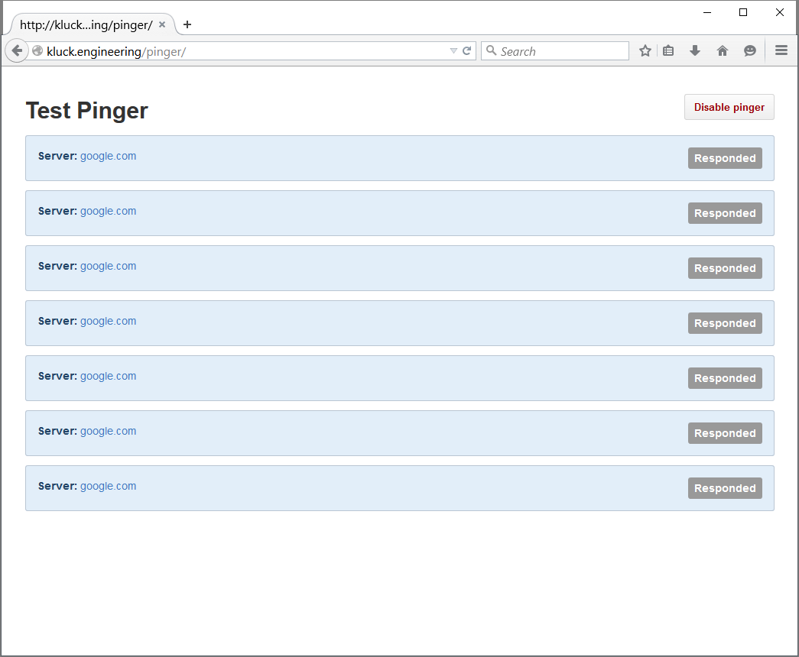

# Pinger

Simple pinger app for testing internet connectivity. Built using Vue.js and Primer CSS.

By default, google.com is pinged every 5 seconds while the app is enabled. Pinging can be toggled within the app.

## Quick links

- [VueJS 2.0 Docs](http://vuejs.org/guide/)
- [Primer CSS](http://primercss.io/)

### Example

